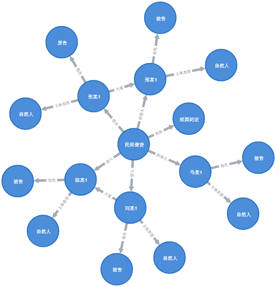

# 中文法律案件知识图谱（Chinese Legal Case Knowledge Graph Dataset）

为了描述复杂场景下主客体之间的法律关系，表示案情事实，构建了法律案件知识图谱。

## 数据格式

每条数据存储为dict，case为案情描述，triples为对应三元组。

```json
{
        "case": "原告张某1，男，1974年10月25日出生，汉族，农民。被告刘某1，男，1983年11月8日出生，蒙古族，农民。被告陈某1，女，1981年2月8日出生，蒙古族，农民。被告马某1，男，1969年7月18日出生，蒙古族，农民。被告邢某1，女，1969年12月29日出生，汉族，农民。\n\n原告邢彩波诉称，被告刘某1与被告陈某1、被告马某1与被告邢某1系夫妻关系。2015年11月5日，被告刘某1、被告陈某1由被告马某1、被告刑立燕担保向原告借款20000元，约定借款利息2.5分。此款被告一直未偿还。故诉至法院，要求四被告连带偿还原告欠款20000元，利息2500元，合计22500元。被告刘某1、被告陈某1、被告马某1、被告邢某1未提出答辩，亦未提供任何证据。原告张某1为证明其诉讼请求，在举证期限内提交了借据一份（其主要内容是：借据今借张某1人民币贰万元整，￥20000元，月利息按2.5分计算。借款人刘某1、陈某1，担保人马某1、邢某1。此借据发生纠纷归赤峰市元宝山区人民法院管辖，此借据担保人有效期至借款人还清借款为止。2015年11月5日。）。证明被告欠原告款项和担保的事实。被告刘某1、被告陈某1、被告马某1、被告邢某1经本院合法传唤无正当理由拒不到庭参加诉讼，本院视为其对原告提交的证据的质证权利的自愿放弃。经本院审查原告提交的证据具有合法性、客观性、关联性，其证明效力本院予以确认，将作为认定案件事实的证据使用。经审理查明，2015年11月5日，被告刘某1、被告陈某1由被告马某1、被告刑立燕担保向原告张某1借款人民币20000元，并出具借据一枚，约定借款月利率为25‰，发生争议由赤峰市元宝山区人民法院管辖。此款各被告一直未偿还。\n",
        "triples": [
            [
                "民间借贷",
                "借出",
                "张某1"
            ],
            [
                "民间借贷",
                "借入",
                "刘某1"
            ],
            [
                "民间借贷",
                "借入",
                "陈某1"
            ],
            [
                "民间借贷",
                "担保人",
                "马某1"
            ],
            [
                "民间借贷",
                "担保人",
                "邢某1"
            ],
            [
                "刘某1",
                "夫妻",
                "陈某1"
            ],
            [
                "马某1",
                "夫妻",
                "邢某1"
            ],
            [
                "民间借贷",
                "利息",
                "纸面约定"
            ],
            [
                "张某1",
                "角色",
                "原告"
            ],
            [
                "刘某1",
                "角色",
                "被告"
            ],
            [
                "陈某1",
                "角色",
                "被告"
            ],
            [
                "马某1",
                "角色",
                "被告"
            ],
            [
                "邢某1",
                "角色",
                "被告"
            ],
            [
                "张某1",
                "主体类型",
                "自然人"
            ],
            [
                "刘某1",
                "主体类型",
                "自然人"
            ],
            [
                "陈某1",
                "主体类型",
                "自然人"
            ],
            [
                "马某1",
                "主体类型",
                "自然人"
            ],
            [
                "邢某1",
                "主体类型",
                "自然人"
            ]
        ]
    }
```

## 知识图谱

